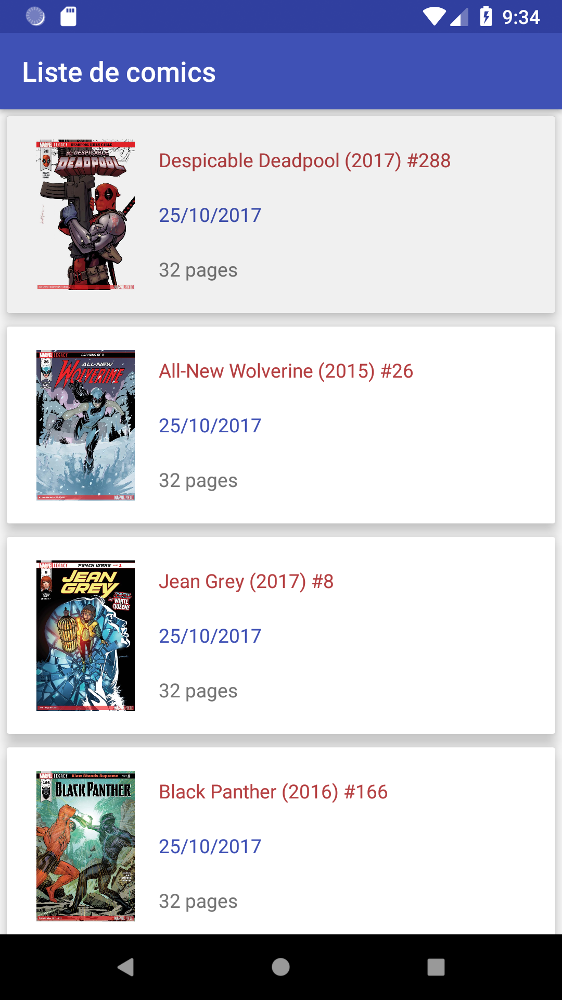

[](https://api.travis-ci.org/RBTWCoderProprement/coder-proprement-project)
# coder-proprement-project - Projet étudiant

Ce projet présente une liste de Comics de l'API Marvel, récupérés depuis un fichier JSON fourni. Ce fichier est un résultat contenant plusieurs comics et un code d'état, 200 ou 500 en fonction du fichier JSON chargé.

 


# Structure du projet

Le code est structuré de manière à bien différencier les couches de traitement des données et la présentation.

- data
  - manager : Traitement de la récupération des données et des fichiers JSON
  - repository : Appels de données nécessaires pour le manager
  - model : Classes modèles de l'application, contiennent les propriétés des objets de l'application
  
- presentation
  - presenter : Gestion des erreurs et appels aux méthodes get du repository
  - ui
    - activity : Activités de l'application, List et Detail, récupèrent les données ; implémentes leurs interfaces dans view
    - view : Interfaces des activités
    - adapter : Les classes "adapter" des listes des comics et des "creators" des comics dans le détail
    - viewholder : Les ViewHolder des adapater pour l'affichage des données dans le layout
  - wrapper : Contient le wrapper de comic et les méthodes de conversion de timestamp, et de partage
  
## Intégration continue

Le fichier fastlane est configuré pour 3 lanes :

```fastlane build_debug```

  Build du projet et création du fichier apk dans build/apk
 
```fastlane build_test```

  Permet de lancer les Tests Unitaires du projet

```fastlane build_for_screenshots```

  Build du projet et de AndroidTest, Capture d'écran qui son stocker dans : fastlane/metadata/en-us/image/phoneScreenshot

Un Travis est connecté à ce GitHub pour le build automatique : https://travis-ci.org/RBTWCoderProprement/coder-proprement-project

## Changement du fichier JSON

Afin de tester les erreurs si le code lors de la récupération est différent de 200, le fichier JSON peut être changé par un fichier d'erreur.

Pour cela il faut se rendre dans com.example.loic.comics_app_android et dans data/manager/ComicManagerImpl et changer la ligne suivante (ligne 24) :

  ```private int currentJson = jsonSuccess;```
  
par

  ```private int currentJson = jsonError;```
